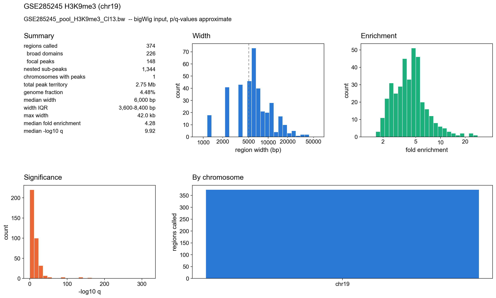
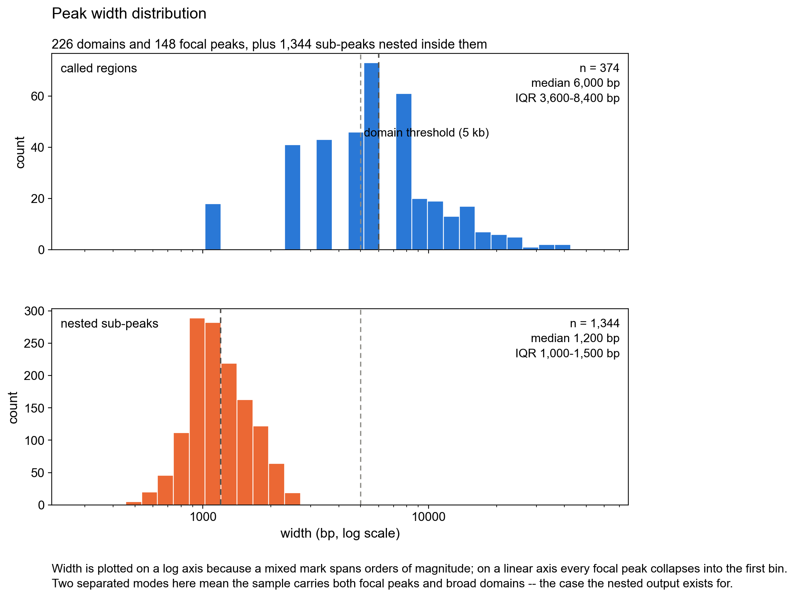
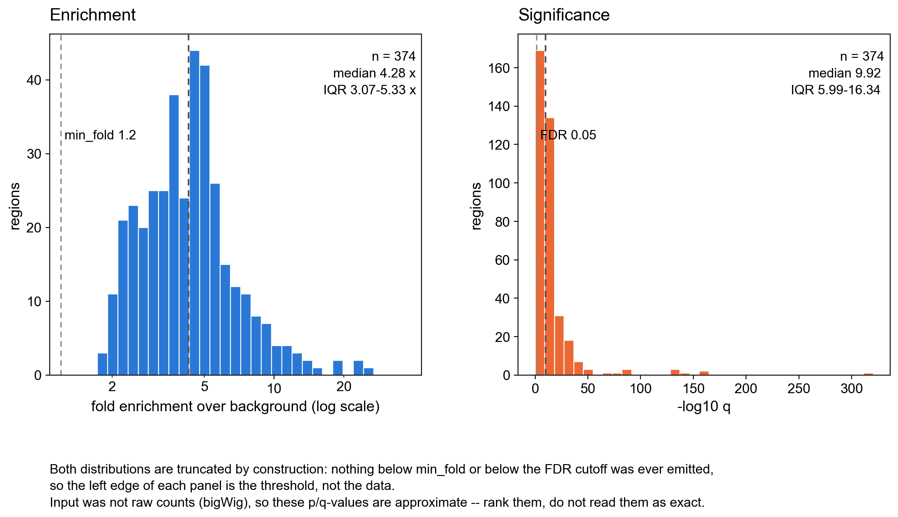
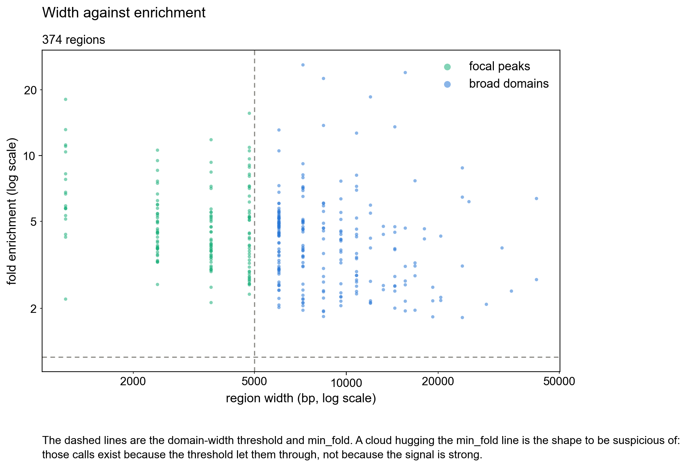

# Tutorial: A Tiny Reproducible FlexPeak Run

This tutorial uses synthetic data generated from a fixed seed, so it is small,
fast, and self-contained. The real-data integration test lives in
[`testing/`](../testing/README.md) and downloads its public GEO input on demand.

## Install

```bash
cd /path/to/FlexPeak
pip install -e ".[figures,fast]"
```

Use `python -m flexpeak.cli` anywhere below if `flexpeak` is not on your `PATH`.

## Run

```bash
python examples/tutorial_simple.py
```

The script creates one mixed synthetic sample with known truth, calls peaks, and
writes outputs under `examples/tutorial_out/`:

```text
examples/tutorial_out/
  tutorial_mixed_peaks.narrowPeak
  tutorial_mixed_peaks.broadPeak
  tutorial_mixed_nested.bed
  tutorial_mixed_peaks.nested.tsv
  tutorial_mixed_qc.txt
```

`tutorial_mixed_peaks.nested.tsv` is the native format. It preserves the
parent/child relationship between broad regions and nested sub-peaks, so it is
the file to use when re-running QC or figures later.

## Inspect QC

```bash
cat examples/tutorial_out/tutorial_mixed_qc.txt
```

Read these rows first:

- `regions`, `domains`, and `subpeaks`: the shape of the call set.
- `genome fraction`: how much territory was called.
- `FRiP`: fraction of signal inside called regions.
- `width bimodality`: whether widths look like one population or a mixed
  narrow/broad sample.

## Redraw Figures

```bash
flexpeak stats \
  -p examples/tutorial_out/tutorial_mixed_peaks.nested.tsv \
  --outdir examples/tutorial_out/figures
```

Every figure is set in Arial with black text. Each panel is an unfilled box with
a black outline, and there are no grid or other background lines inside it.

## Figures From Real Data

The real-data test in [`testing/`](../testing/README.md) calls peaks on a public
H3K9me3 bigWig (GEO GSE285245, mm10, chr19) and keeps four of its statistics
figures here. Regenerate them with:

```bash
python testing/run_geo_h3k9me3.py --quick --keep-figures
```

The one-page summary: counts, width, enrichment, significance, and per-chromosome
totals.



Region widths and nested sub-peak widths on one log axis. H3K9me3 produces mostly
broad domains, with narrower sub-peaks nested inside them.



Fold enrichment and significance. Both are cut off at the call thresholds, so
the left edge of each panel is set by the threshold, not by the data. bigWig
input is not raw counts, so these q-values are approximate.



Width against enrichment: a large group of calls sitting just above the
`min_fold` line is a sign of weak calls.


